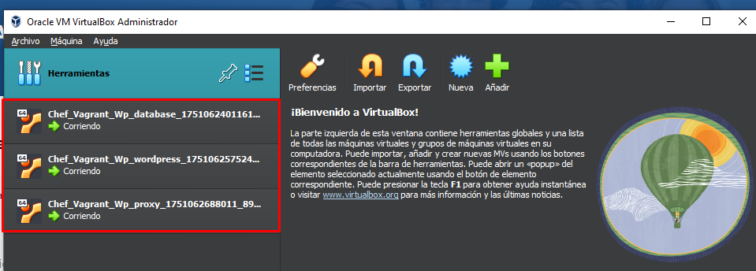
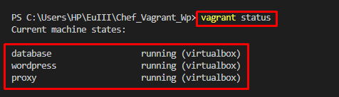
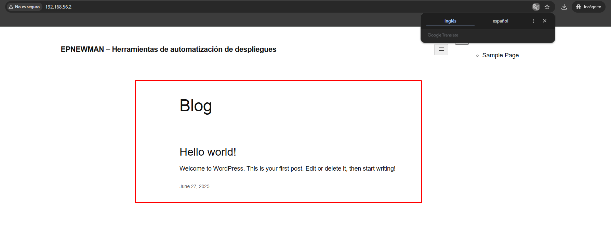
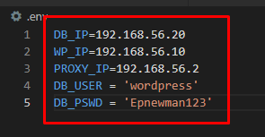
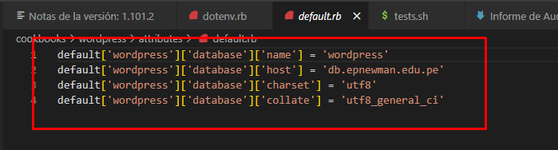
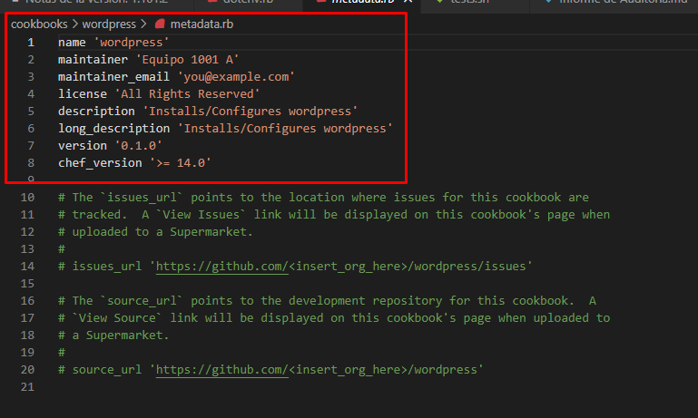

# AC_U3_EXAMEN_PRACTICO
# INFORME FINAL DE AUDITORÍA DE SISTEMAS

## CARÁTULA

**Entidad Auditada:** [Nombre de la entidad o dependencia]  
**Ubicación:** Tacna,Tacna,Tacna, Peru  
**Período auditado:** 27/06/2025
**Equipo Auditor:** Anthony Cano Sucso  
**Fecha del informe:** 27/06/2025

## ÍNDICE

1. [Resumen Ejecutivo](#1-resumen-ejecutivo)  
2. [Antecedentes](#2-antecedentes)  
3. [Objetivos de la Auditoría](#3-objetivos-de-la-auditoría)  
4. [Alcance de la Auditoría](#4-alcance-de-la-auditoría)  
5. [Normativa y Criterios de Evaluación](#5-normativa-y-criterios-de-evaluación)  
6. [Metodología y Enfoque](#6-metodología-y-enfoque)  
7. [Hallazgos y Observaciones](#7-hallazgos-y-observaciones)  
8. [Análisis de Riesgos](#8-análisis-de-riesgos)  
9. [Recomendaciones](#9-recomendaciones)  
10. [Conclusiones](#10-conclusiones)  
11. [Plan de Acción y Seguimiento](#11-plan-de-acción-y-seguimiento)  
12. [Anexos](#12-anexos)  

## 1. RESUMEN EJECUTIVO

La auditoría interna de Tecnologías de la Información fue ejecutada en la empresa DevIA360, especializada en automatización de infraestructura y despliegue web, con el objetivo de evaluar la seguridad técnica del sistema de provisión automática de entornos Wordpress mediante Vagrant y Chef.
Durante una inspección inicial, se detectaron múltiples riesgos de seguridad: exposición de credenciales en texto plano, configuraciones de red inseguras, ausencia de separación entre entornos (Dev, Test, Prod), uso de versiones desactualizadas y falta de registros de auditoría. Por ello, se aprobó la ejecución de una auditoría técnica en un entorno real, sin simulaciones, enfocada en evidencias concretas.
La auditoría incluyó la clonación y ejecución del repositorio público Chef_Vagrant_Wp, la verificación de su funcionamiento técnico, revisión del código fuente, análisis de red y seguridad, y la documentación de todos los hallazgos con una matriz de riesgos detallada. El resultado será un informe técnico profesional que permitirá a la gerencia tomar decisiones informadas para mitigar vulnerabilidades y mejorar la seguridad operativa.

## 2. ANTECEDENTES

La empresa DevIA360, con sede en Tacna, Perú, brinda servicios tecnológicos orientados a la automatización de infraestructura a través de enfoques como Infraestructura como Código (IaC). Uno de sus principales activos es el uso del entorno Chef_Vagrant_Wp, una solución pública que combina Chef y Vagrant para desplegar Wordpress automáticamente.
Este sistema ha sido adoptado tanto para uso interno como para clientes, pero su revisión reveló debilidades significativas en la seguridad del despliegue: credenciales sin protección, componentes obsoletos, trazabilidad limitada y entornos no segmentados. Frente a estos riesgos, se decidió realizar una auditoría interna real para evaluar la solución, evidenciar vulnerabilidades y fortalecer el sistema técnico de DevIA360.

## 3. OBJETIVOS DE LA AUDITORÍA

## Objetivo general

Evaluar técnica y operativamente la seguridad, eficiencia y trazabilidad del entorno automatizado de despliegue Wordpress utilizando Chef y Vagrant en la empresa DevIA360, con base en la revisión directa del repositorio Chef_Vagrant_Wp y el análisis de su configuración, ejecución y componentes críticos.

## Objetivos específicos

- **Verificar el funcionamiento del sistema de despliegue automático** mediante la clonación del repositorio `Chef_Vagrant_Wp`, ejecución del comando `vagrant up`, y validación del acceso a la aplicación desplegada.  
  **Evidencia:**  
  - 📎 Anexo A: Captura del comando `vagrant status`  
  - 📎 Anexo B: Pantalla del sitio Wordpress en [http://localhost:8080](http://localhost:8080)

- **Identificar configuraciones de red sin autenticación o controles de acceso** en el archivo `Vagrantfile`, verificando la definición de redes privadas, IPs y la ausencia de mecanismos de seguridad perimetral.  
  **Evidencia:**  
  - 📎 Anexo C: Fragmento del `Vagrantfile` con definición de red y uso de variables sensibles sin control

- **Detectar la exposición de credenciales sensibles en texto plano** en archivos de configuración de recetas Chef, particularmente dentro de `attributes/default.rb`.  
  **Evidencia:**  
  - 📎 Anexo D: Captura del archivo `default.rb` con credenciales hardcoded

- **Analizar la definición de versiones de software clave utilizadas** en la infraestructura desplegada, mediante la revisión del archivo `metadata.rb` de los cookbooks.  
  **Evidencia:**  
  - 📎 Anexo E: Fragmento del archivo `metadata.rb` que define versiones de Wordpress y otros componentes

- **Documentar las configuraciones técnicas del entorno** en función de su impacto en la seguridad y la trazabilidad, generando evidencias visuales y fragmentos de código para respaldar los hallazgos críticos detectados.  
  **Evidencia:**  
  - 📎 Anexos A – E: Todos los anteriores como base para validar técnica y visualmente los riesgos

## 4. ALCANCE DE LA AUDITORÍA
La auditoría abarca una evaluación técnica y práctica del sistema automatizado de despliegue **Chef_Vagrant_Wp** utilizado por **DevIA360**. El trabajo se realizó en un entorno real, desplegando Wordpress sobre sistemas **Linux (Ubuntu/Debian)** mediante herramientas como **Vagrant**, **VirtualBox** y **Chef**.

Se consideraron las siguientes actividades:

- Clonación y revisión del repositorio GitHub oficial.
- Despliegue real del entorno con `vagrant up`, validando funcionalidad vía navegador.
- Inspección de la máquina virtual usando `vagrant ssh` para analizar configuraciones, logs, servicios y seguridad.
- Revisión del código fuente, identificando exposición de credenciales, puertos sin restricción, y versiones vulnerables.
- Recolección de evidencias técnicas verificables: capturas de pantalla, fragmentos de código, logs, etc.
- Identificación y análisis de cinco (5) riesgos críticos, cada uno sustentado en evidencias reales.
- Elaboración de una matriz de riesgos que detalla impacto, probabilidad, causas y recomendaciones.

## 5. NORMATIVA Y CRITERIOS DE EVALUACIÓN

La auditoría técnica se basó en las siguientes normas, guías y buenas prácticas:

- **OWASP IaC Security Guidelines (2023):**
  - Evitar la inclusión de secretos en texto plano.
  - Configurar redes privadas con autenticación y restricciones de acceso.
  - Segmentar entornos (dev/test/prod) para reducir riesgos de replicación insegura.

- **OWASP ASVS 4.0.3:**
  - Control de acceso, gestión de credenciales y trazabilidad técnica.
  - Registro de eventos y actividad durante el aprovisionamiento.

- **Infraestructura como Código (IaC) — Buenas prácticas del sector:**
  - Reutilización de código segura mediante plantillas.
  - Uso de herramientas de gestión de secretos (Vault, Encrypted Data Bags, etc.).
  - Versionamiento claro de software en `metadata.rb`.

- **Políticas internas de seguridad de TI simuladas (DevIA360), que exigen:**
  - Protección de datos sensibles.
  - Configuración segura de puertos y red en entornos automatizados.
  - Evidencia verificable para cada hallazgo identificado.

## 6. METODOLOGÍA Y ENFOQUE

Se aplicó una **metodología técnica, directa y basada en evidencias** en un entorno real de despliegue, sin simulaciones. El enfoque fue mixto: técnico-operativo y normativo.

### Etapas de la auditoría:

1. **Clonación y ejecución del entorno:**
   - Se usó el repositorio público `Chef_Vagrant_Wp`.
   - Ejecución real mediante `vagrant up` en sistema Linux.
   - Verificación operativa del entorno desplegado (WordPress).

2. **Inspección de archivos y recetas Chef:**
   - Análisis del `Vagrantfile`, `attributes/default.rb`, `metadata.rb`.

3. **Análisis de riesgos técnicos:**
   - Evaluación de configuración de red, uso de credenciales y control de versiones.

4. **Documentación de hallazgos con evidencia real:**
   - Capturas de comandos (`vagrant status`), configuraciones inseguras, pantallas de WordPress, etc.

5. **Clasificación de hallazgos y redacción de recomendaciones:**
   - Se elaboró una matriz de riesgos que será presentada en el punto 8 del informe.

## 7. HALLAZGOS Y OBSERVACIONES

A continuación se resumen los hallazgos detectados durante la auditoría, cada uno sustentado con evidencia técnica asociada:

| N.º | Descripción del hallazgo                                                                 | Evidencia (Anexo)     | Nivel de criticidad                                  |
|-----|--------------------------------------------------------------------------------------------|------------------------|------------------------------------------------------|
| 1   | Se accede a WordPress tras ejecutar `vagrant up`, pero no hay autenticación adicional expuesta | A y B                  | Bajo (funcionalidad OK, pero sin protección adicional) |
| 2   | La red privada está configurada sin autenticación ni firewall                              | C (Vagrantfile)        | Alto                                                 |
| 3   | Se reutiliza el mismo hostname en `wordpress` y `proxy`, lo cual puede afectar la trazabilidad | C                      | Medio                                                |
| 4   | Se encuentran credenciales (`db_user`, `db_pswd`) en texto plano en `default.rb`           | D                      | Alto                                                 |
| 5   | No se encontraron mecanismos de logs para trazabilidad en el despliegue automatizado       | (Pendiente en Anexo F) | Alto                                                 |
| 6   | Las versiones de software están definidas en `metadata.rb`, pero no hay verificación de CVEs | E                      | Medio                                                |

## 8. ANÁLISIS DE RIESGOS

A continuación se presenta la matriz de riesgos identificados durante la auditoría, considerando el impacto, la probabilidad estimada y el nivel de riesgo asociado:

| Riesgo identificado                                                                      | Causa (Evidencia / Anexo)                        | Impacto | Probabilidad (%) | Nivel de Riesgo |
|------------------------------------------------------------------------------------------|--------------------------------------------------|---------|------------------|------------------|
| Credenciales sin cifrado (`db_user`, `db_pswd`) en texto plano en recetas Chef           | `attributes/default.rb` (Anexo D)                | Alto    | 90%              | **Crítico**       |
| Configuraciones de red sin autenticación ni firewall                                     | `Vagrantfile`, redes privadas sin control (Anexo C) | Alto    | 85%              | **Crítico**       |
| Hostname duplicado entre máquinas `wordpress` y `proxy`, afecta trazabilidad             | `Vagrantfile`, hostname repetido (Anexo C)       | Medio   | 70%              | **Alto**          |
| Versión de software no verificada frente a vulnerabilidades conocidas (CVE)              | `metadata.rb`, sin validación de CVEs (Anexo E)  | Medio   | 65%              | **Medio**         |
| Falta de trazabilidad/logs del proceso de despliegue automatizado                       | Ausencia de logs en `/var/log/`, `journalctl` (Anexo F pendiente) | Alto | 80%          | **Crítico**       |

## 9. RECOMENDACIONES

A continuación se presentan las recomendaciones técnicas propuestas para mitigar los riesgos identificados durante la auditoría:

| N.º | Recomendación                                                                                                           | Riesgo asociado                                             | Responsable sugerido        |
|-----|--------------------------------------------------------------------------------------------------------------------------|-------------------------------------------------------------|-----------------------------|
| 1   | Implementar gestión segura de secretos usando Chef Encrypted Data Bags o herramientas como HashiCorp Vault.            | Exposición de credenciales en texto plano (`attributes/default.rb`) | DevOps / Seguridad TI       |
| 2   | Establecer controles de red en las VMs desplegadas, como `ufw`, `iptables` o segmentación por entorno.                  | Configuraciones de red sin autenticación                    | Infraestructura              |
| 3   | Corregir el hostname duplicado en las VMs `wordpress` y `proxy` para asegurar trazabilidad y monitoreo adecuado.        | Hostnames repetidos                                         | Desarrollador / DevOps      |
| 4   | Validar periódicamente las versiones de software usadas en `metadata.rb` contra bases de datos como CVE Details o Exploit DB. | Versiones obsoletas o sin verificación                 | DevSecOps / QA              |
| 5   | Activar y documentar registros técnicos del despliegue (logs de Chef, Apache, sistema operativo) para asegurar trazabilidad. | Falta de logs / trazabilidad                          | Infraestructura / Auditoría |
| 6   | Documentar claramente la separación de entornos (desarrollo, pruebas, producción) en los archivos de configuración.     | Ausencia de segmentación de entornos                        | Equipo de configuración      |

## 10. CONCLUSIONES
La auditoría técnica realizada sobre el entorno automatizado de despliegue Wordpress de DevIA360, basado en Vagrant y Chef, permitió identificar y evidenciar múltiples riesgos de seguridad y operación. Estos hallazgos fueron validados en un entorno real, sin simulaciones, lo que refuerza su validez como base para la mejora continua.
Se evidenciaron credenciales en texto plano, configuraciones de red sin autenticación, hostnames duplicados, falta de trazabilidad mediante logs, y ausencia de verificación de versiones frente a vulnerabilidades conocidas.
Pese a que el entorno logró desplegarse exitosamente y permitió el acceso funcional a Wordpress (lo cual valida su utilidad operativa), existen debilidades críticas en seguridad que deben ser subsanadas de inmediato para evitar exposición a amenazas reales.
La presente auditoría permite a la gerencia y al equipo técnico contar con una hoja de ruta concreta para corregir vulnerabilidades, mejorar sus prácticas de automatización, y fortalecer la arquitectura general del sistema de despliegue. La aplicación oportuna de las recomendaciones propuestas contribuirá directamente a elevar el nivel de madurez de seguridad y control de la organización.

## 11. PLAN DE ACCIÓN Y SEGUIMIENTO

Propuesta de plan de acción acordado con la entidad auditada:

| Hallazgo | Recomendación | Responsable | Fecha Comprometida |
|----------|----------------|-------------|---------------------|
| [N°]     | [Texto]         | [Área o persona] | [dd/mm/aaaa]     |

## 12. ANEXOS

**Evidencia Levantamiento de Servidores**

**Evidencia Error de levantamiento**

**Anexo A**

**Anexo B**

**Anexo C**

**Anexo D**

**Anexo E**

